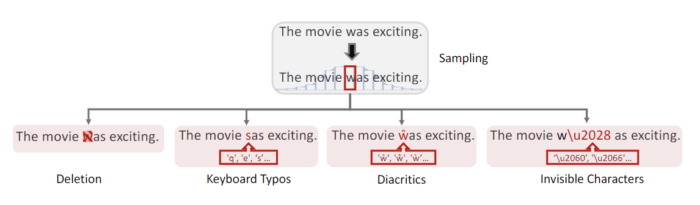

# PdD: A Character-level Perturbation Generator

We proposed a framework of character-level perturbation called PdD based on three metrics, **P**robability distribution, **D**ensity and **D**iversity. This is a project about character-level perturbation to text.

Each sentence is represented by a list of characters.

## Introduction

For example, the sentence "I am the best student in the world." would be represented by the list `['I', ' ', 'a', 'm', ' ', 't', 'h', 'e', ' ', 'b', 'e', 's', 't', ' ', 's', 't', 'u', 'd', 'e', 'n', 't', ' ', 'i', 'n', ' ', 't', 'h', 'e', ' ', 'w', 'o', 'r', 'l', 'd', '.']`.

There are three main parameters that control the perturbation:

- **Probability Distribution**: This parameter defines the probability distribution of all characters being perturbed. There are currently two choices: uniform and normal distribution. The corresponding classes are defined in `distribution.py`.
- **Density**: This parameter controls how many characters will be perturbed, e.g., a density of $0.1$ means that $10\%$ of characters will be perturbed. This parameter should be a float between $0$ and $1$. It is controlled in `sampler.py`.
- **Diversity**: This parameter describes the possible substituted characters for each character. We provide different dictionaries for this parameter, which are located in the `diversity` folder. For each character, there is a list of possible substitutions. For example, 'a' can be perturbed and replaced with 's' or 'z'; therefore, the dictionary will have a key of `'a'` and a value of `['s', 'z']`. Currently, we have the following dictionaries.
  - Deletion: It replaces a character with an empty char `''`.
  - Space: It replaces a character with a space char `' '`.
  - Letter cases: It changes the cases of a letter, e.g. `'a'` to `'A'` or `'A'` to `'a'`.
  - Shift-key: It replaces a character with the corresponding key when using or not using the shift key.
  - Keyboard Typo: It replaces a character with the nearest character on a keyboard.
  - Homoglyphs: It replace a character with its homoglyph.
  - Invisible Chars: It insert an invisible chars to after the original letter.

## Usage

The file `main.py` provides an example of how to perturb a sentence. You just need to specify the three parameters described above and build a generator. Then, you can obtain a perturbed version of the original sentence.

### About customized perturbation dictionary

You can create your perturbation dictionary like what we do in the `diversity` folder.

### About perturbation to specified characters in specified position

Currently, all characters in the given sentence has a possibility to be perturbed. Therefore, If you want to perturb specified character on specified location, you need to preprocess the input sentence.

